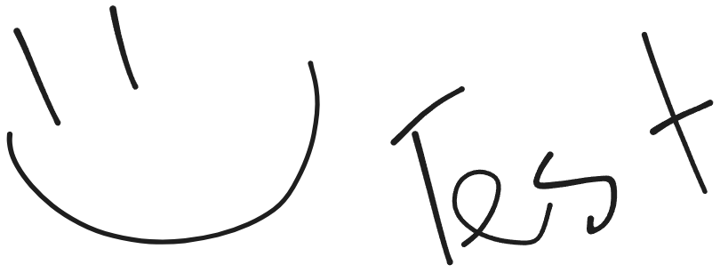

# Heading 1

## Heading 2

### Heading 3

#### Heading 4

##### Heading 5
  
Paragraphs and bullet points are really cool look at these!!!!
- One (1)
- Two (2)
- Three (2)

And this **bold** text is so **cool**:

Tables:

| Thing that says a thing or two | 1   | 2   | 3   |
| ------------------------------ | --- | --- | --- |
| 1                              | 1   | 2   | 3   |
| 2                              | 2   | 3   | 4   |
| 3                              | 3   | 4   | 5   |
| 4                              | 4   | 5   | 6   |
 
but i do like *italic* stuff too

what about code??
``` cpp

int main()

{

    return 0; // sick application

}

```
and links?
 [Test to Google](https://dev.epicgames.com/documentation/en-us/unreal-engine/distance-field-ambient-occlusion-in-unreal-engine)

and local images? do they get transferred?

